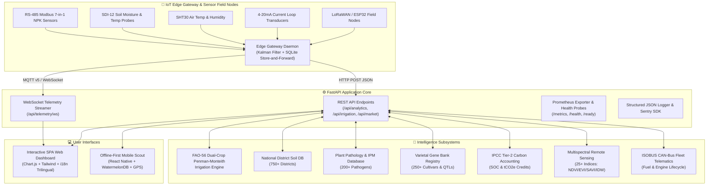

# 🏗️ AgriSphere OS - System Architecture & Engineering Specifications

This document provides a comprehensive technical blueprint of the **AgriSphere OS (Smart Agriculture Platform)** architecture, telemetry pipelines, agronomic AI engines, and infrastructure topology.

---

## 🌐 1. High-Level System Architecture

---

## 📡 2. End-to-End Telemetry Pipeline

1. **Sensor Interfacing**: RS-485 Modbus RTU, SDI-12 v1.4, and 4-20mA current loop sensors sample field parameters every 2.5 seconds.
2. **Noise Reduction & Anomaly Detection**: 1D Kalman filters smooth analog sensor jitter while variance threshold algorithms detect frozen or drifting probe signals.
3. **Edge Resilience**: If WAN connectivity is interrupted, the edge buffer preserves telemetry packets in local SQLite storage and bursts data upstream once reconnecting.
4. **Real-Time Distribution**: The FastAPI backend broadcasts multi-zone sensor streams via asynchronous WebSockets to connected dashboards in sub-50ms latency.

---

## 💧 3. Precision Irrigation Water Balance Math

The irrigation controller computes root zone depletion ($D_{r,i}$) on a daily time-step:

$$D_{r,i} = D_{r,i-1} - (P_i - RO_i) - I_i - CR_i + ET_{c,i} + DP_i$$

Where:
- $ET_{c,i} = (K_{cb} + K_e) \cdot ET_0$
- $ET_0$: FAO-56 Reference Evapotranspiration computed via Penman-Monteith energy balance equation.
- $K_{cb}$: Basal crop coefficient.
- $K_e$: Soil evaporation coefficient.
- Soil Water Stress Coefficient: $K_s = \frac{TAW - D_r}{(1 - p) \cdot TAW}$.

---

## 📊 4. Observability, Logging & Health Probes

| Endpoint | Protocol | Purpose | Expected Output |
| :--- | :---: | :--- | :--- |
| `/health` | HTTP GET | Liveness probe for Kubernetes / Docker | `{"status": "healthy", "timestamp": ...}` |
| `/ready` | HTTP GET | Readiness probe for traffic routing | `{"status": "ready", "database": "ready"}` |
| `/metrics` | HTTP GET | Prometheus scraper endpoint | Prometheus text format with request counts & latency |
| `/api/telemetry/ws` | WebSocket | Real-time sensor streaming | JSON Telemetry Packets |
